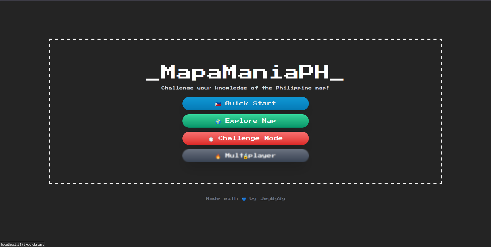
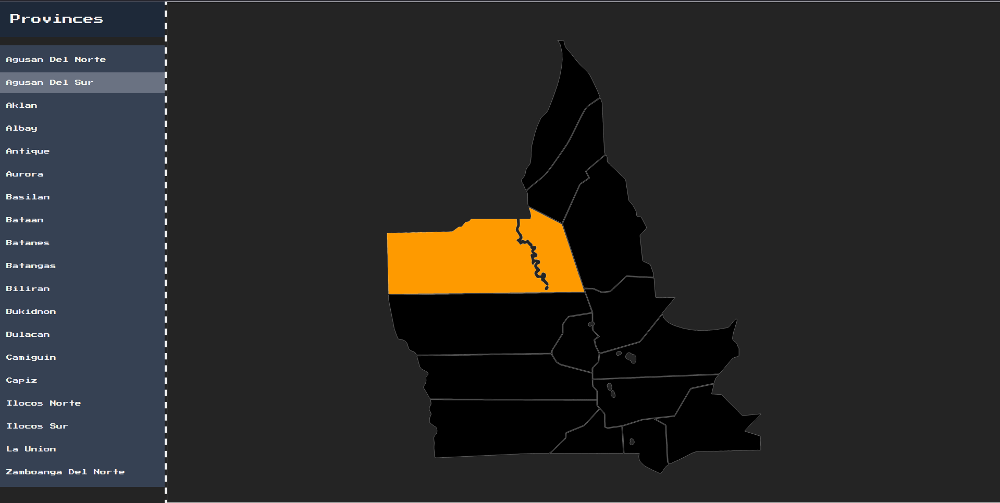
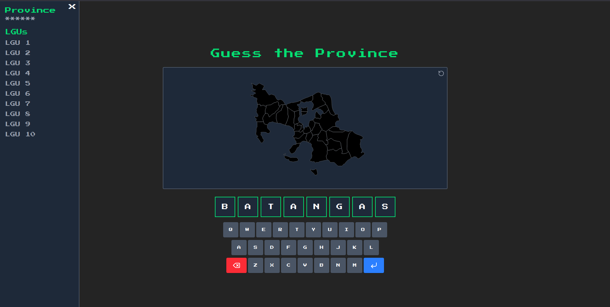

# 🇵🇭 MapaMania — Challenge your knowledge of the Philippine map!

**MapaMania** is a web-based quiz game that challenges you to learn and identify regions, provinces, and municipalities of the Philippines through an engaging, interactive SVG map.

### 🎮 Game Modes

- **🇵🇭 Quick Start**  
  Three pre-selected province. Guess the province first then proceed to guess it's city/municipal.
  A fast-paced, 12-question quiz with two type of challenge to choose from:

  - **Typing Challenge** - Type the name of the highlighted province. ex. ( B _ _ A _ _ A S ) <i>with hint</i>

- **🌍 Explore Map**  
- **⏱️ Challenge Mode**  
- **🔥 Multiplayer** *Experimental with realtime feature*  

---

## 🗺️ Tech Stack

- **Frontend:** React + TypeScript  
- **Styling:** Tailwind CSS  
- **Map Integration:** Custom SVG of the Philippine provinces/municipalities  

---

## 📸 Screenshots

