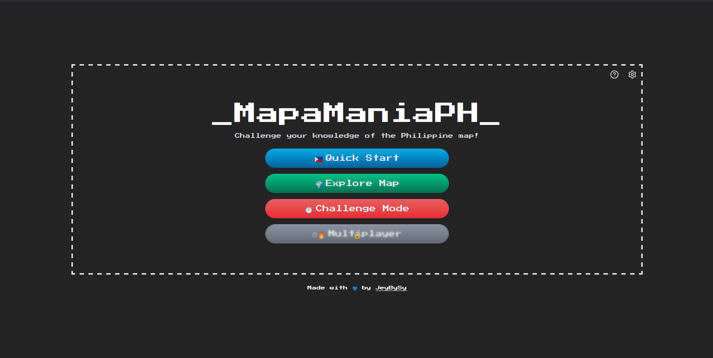
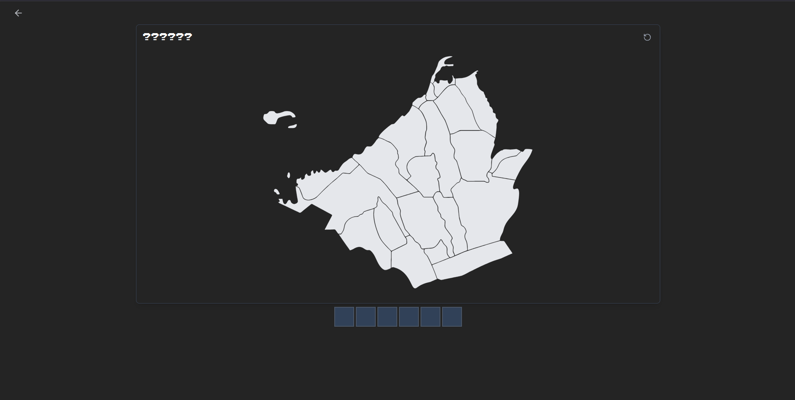
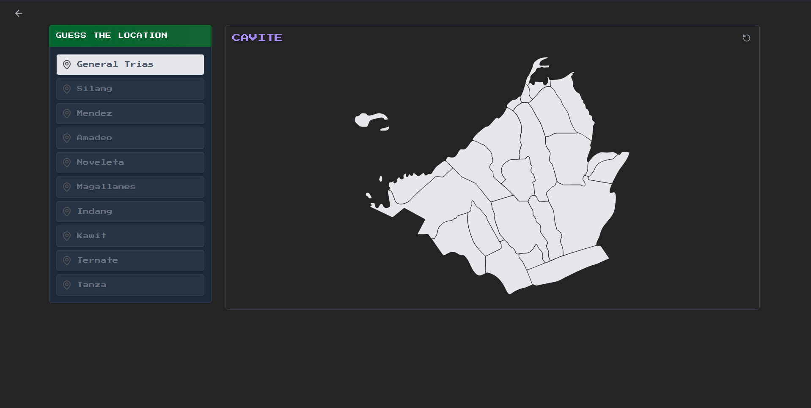
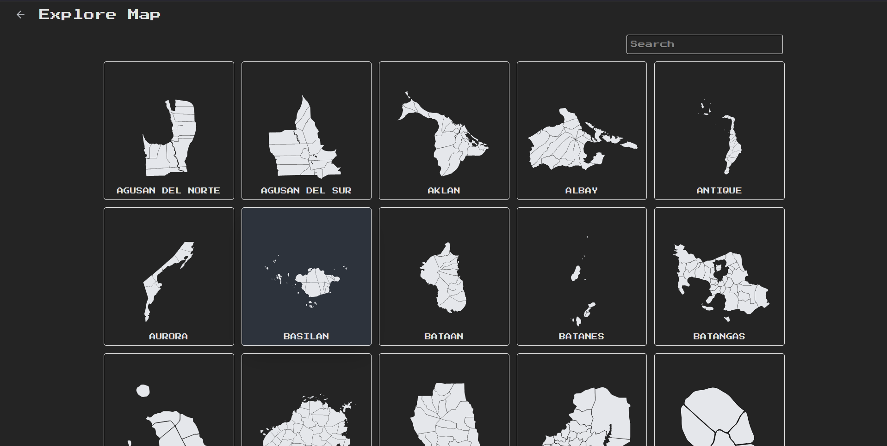
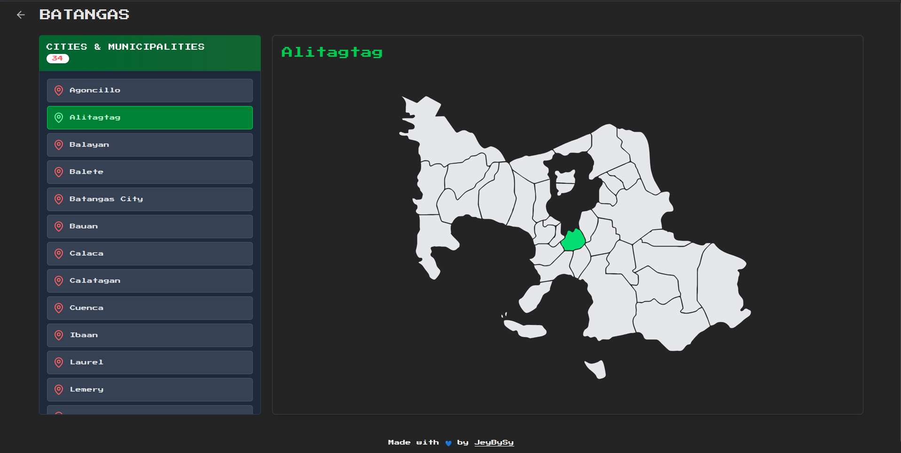

# 🇵🇭 MapaManiaPH — Challenge your knowledge of the Philippine map!

**MapaManiaPH** is a web-based quiz game that challenges you to learn and identify cities, provinces, and municipalities of the Philippines through an engaging, interactive SVG map.

### 🎮 Game Modes

- **🇵🇭 Quick Start**  
Start by guessing the province, then move on to identifying its cities or municipalities.
Type the name of the highlighted province (e.g., B _ _ A _ _ A S).
You’ll answer a total of 11 questions — 1 for the province and 10 for its cities or municipalities.
There’s no limit on mistakes, so take your time and have fun! 

- **🌍 Explore Map**
Dive into the interactive map and select any province to explore its cities and municipalities. This is where you review, inspect, and familiarize yourself with different areas—perfect for brushing up before playing the guessing game.

- **⏱️ Challenge Mode**
Test your knowledge under pressure! You have 3 lives to guess each location correctly. One wrong answer costs a life—lose them all, and it’s game over. Can you make it to the end?

- **🔥 Multiplayer** *Experimental with realtime feature*  

---

## 🗺️ Tech Stack

- **Frontend:** React + TypeScript  
- **Styling:** Tailwind CSS  
- **Map Integration:** Custom SVG of the Philippine provinces/municipalities  

---

## 📸 Screenshots

